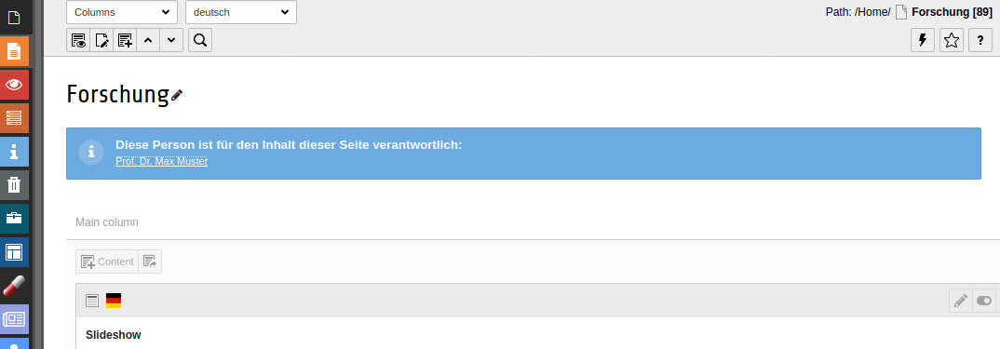

# TYPO3 extension in2responsible

## Introduction

Show a responsible editor in TYPO3 backend page module for a page

## Introduction



## Requirements and installation

```
composer require in2code/in2responsible
```

## Changelog

| Version    | Date       | State      | Description                                                                  |
| ---------- | ---------- | ---------- | ---------------------------------------------------------------------------- |
| 4.0.0      | 2020-03-11 | TASK       | Update for TYPO3 9.5                                                         |
| 3.0.0      | 2017-09-20 | TASK       | Update for TYPO3 8.7                                                         |
