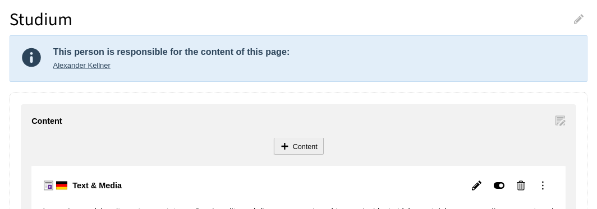
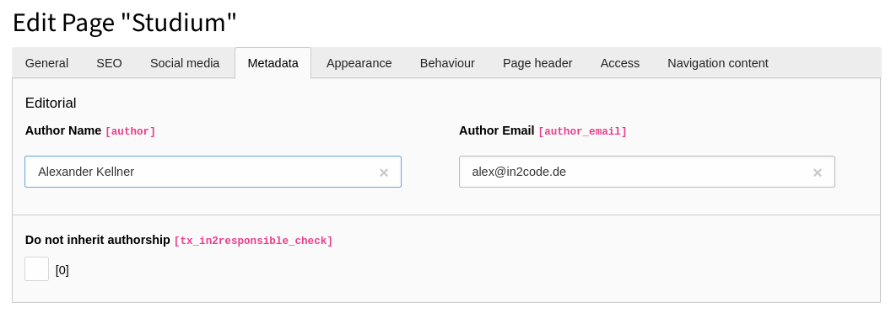

# TYPO3 extension in2responsible

## Introduction

Small TYPO3 extension to show a responsible editor in TYPO3 backend page module for a page. Useful for large TYPO3
instances like those from universities and higher education.






## Requirements and installation

```
composer req in2code/in2responsible
```


## Configuration

Use Page TSConfig for a general configuration:

### TYPO3 12

```
tx_in2responsible {
	note {
		active = 1
		templatePath = EXT:in2responsible/Resources/Private/Templates/Note.html
	}
}
```

In HTML template file, fields and labels can be defined

### TYPO3 11

```
tx_in2responsible {
	showMessage = 1
	message = Diese Person ist für den Inhalt dieser Seite verantwortlich:
	name = Name des Ansprechpartners
	name.field = author
	email =
	email.field = author_email
	check =
	check.field = tx_in2responsible_check
}
```


## DataProcessing in frontend (TYPO3 12 only)

If you want also to show name and/or email of the responsible author in frontend, you can use the delivered
DataProcessor in TypoScript and Fluid:

```
100 = In2code\In2responsible\DataProcessing\ResponsibleProcessor
100 {
    as = responsibleData
}
```

```
<f:if condition="{responsibleData.author} && {responsibleData.author_email}">
	<f:link.email email="{responsibleData.author_email}" class="btn btn--right-link">Send feedback</f:link.email>
</f:if>
```

## Breaking changes / Upgrade Info

### Update to version 13.0.0

- Field pages.tx_in2responsible_check is not checked any more by default. See commit message for details.

## Contribution with ddev

This repository provides a [DDEV]()-backed development environment. If DDEV is installed, simply run the following
commands to quickly set up a local environment with example usages:

* `ddev start`
* `ddev initialize`

### Requirements

1. Install ddev, see: https://ddev.readthedocs.io/en/stable/#installation
2. Install git-lfs, see: https://git-lfs.github.com/

### Installation

1. Clone this repository
2. Run `ddev start`
3. Run `ddev initialize` to setup configurations and test database

## Branchinfo

* master Branch - Next Major Version

## Early Access Programm for TYPO3 14 support

:information_source: **TYPO3 14 compatibility**
> See [EAP page (DE)](https://www.in2code.de/agentur/typo3-extensions/early-access-programm/) or
> [EAP page (EN)](https://www.in2code.de/en/agency/typo3-extensions/early-access-program/) for more information how
> to get access to a TYPO3 14 version

## Changelog

| Version | Date       | State      | Description                                                        |
|---------|------------|------------|--------------------------------------------------------------------|
| 13.0.0  | 2025-05-23 | [!!!] Task | Support TYPO3 13 only                                              |
| 7.1.0   | 2024-03-05 | Feature    | Add DataProcessor for frontend rendering of the responsible person |
| 7.0.0   | 2024-03-05 | Task       | Update for TYPO3 12, also dropped support for TYPO3 9 and 10       |
| 6.0.0   | 2022-02-25 | [!!!] Task | Update for TYPO3 11.5. Drop support of TYPO3 8.x                   |
| 5.0.0   | 2021-06-09 | [!!!] Task | Update for TYPO3 10.4. Drop support of TYPO3 6.x and 7.x           |
| 4.0.0   | 2020-03-11 | Task       | Update for TYPO3 9.5                                               |
| 3.0.0   | 2017-09-20 | Task       | Update for TYPO3 8.7                                               |
